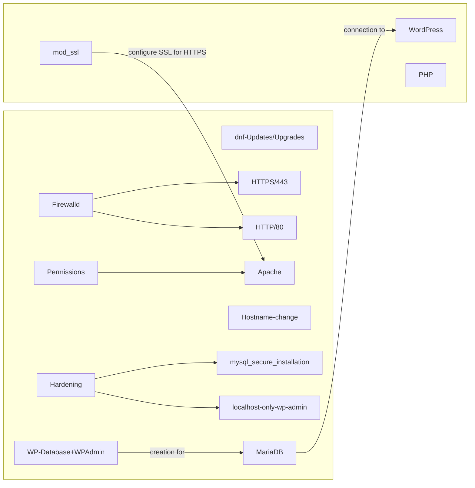
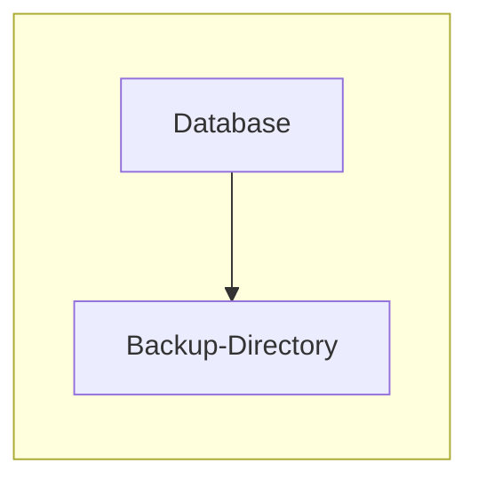

## Script Descriptions
These are scripts I made for NCyTE's VCCC. 

wp_db contains a 4 part script used to build and configure a WordPress `LAMP` stack (Linux, Apache, MariaDB, and PHP), these scripts are made for RPM-based distros like RHEL, Rocky, Alma,CentOS 

db_dump contains a single script used to take a sql or mariadb database and dump its contents, additional details to have this script work properly are inside of the script's directory.

---

